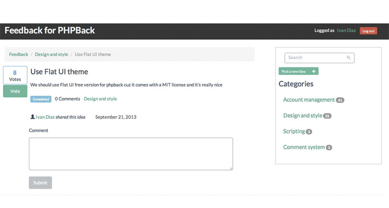

<!--
NOTA: Este README foi creado automáticamente por <https://github.com/YunoHost/apps/tree/master/tools/readme_generator>
NON debe editarse manualmente.
-->

# PHPBack para YunoHost

[](https://ci-apps.yunohost.org/ci/apps/phpback/)


[](https://install-app.yunohost.org/?app=phpback)

*[Le este README en outros idiomas.](./ALL_README.md)*

> *Este paquete permíteche instalar PHPBack de xeito rápido e doado nun servidor YunoHost.*  
> *Se non usas YunoHost, le a [documentación](https://yunohost.org/install) para saber como instalalo.*

## Vista xeral

PHPBack is an open source feedback system you can use for your website. It gives your customers a way to communicate their ideas to improve your products. User feedback has proved to be really effective even if you have a community project or a commercial project. 

**Versión proporcionada:** 1.3.2~ynh1

**Demo:** <https://www.phpback.org/demo/>

## Capturas de pantalla



## Documentación e recursos

- Web oficial da app: <https://www.phpback.org/>
- Repositorio de orixe do código: <https://github.com/phpback/phpback>
- Tenda YunoHost: <https://apps.yunohost.org/app/phpback>
- Informar dun problema: <https://github.com/YunoHost-Apps/phpback_ynh/issues>

## Info de desenvolvemento

Envía a túa colaboración á [rama `testing`](https://github.com/YunoHost-Apps/phpback_ynh/tree/testing).

Para probar a rama `testing`, procede deste xeito:

```bash
sudo yunohost app install https://github.com/YunoHost-Apps/phpback_ynh/tree/testing --debug
ou
sudo yunohost app upgrade phpback -u https://github.com/YunoHost-Apps/phpback_ynh/tree/testing --debug
```

**Máis info sobre o empaquetado da app:** <https://yunohost.org/packaging_apps>
