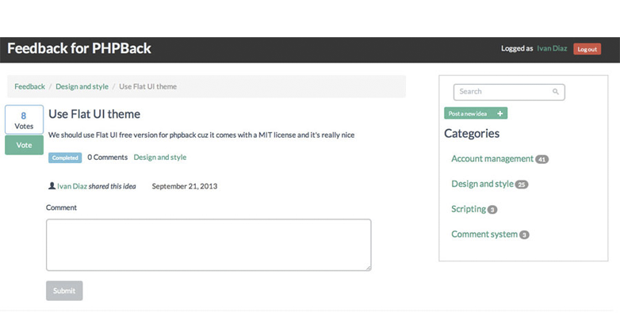

<!--
N.B.: README ini dibuat secara otomatis oleh <https://github.com/YunoHost/apps/tree/master/tools/readme_generator>
Ini TIDAK boleh diedit dengan tangan.
-->

# PHPBack untuk YunoHost

[](https://ci-apps.yunohost.org/ci/apps/phpback/)


[](https://install-app.yunohost.org/?app=phpback)

*[Baca README ini dengan bahasa yang lain.](./ALL_README.md)*

> *Paket ini memperbolehkan Anda untuk memasang PHPBack secara cepat dan mudah pada server YunoHost.*  
> *Bila Anda tidak mempunyai YunoHost, silakan berkonsultasi dengan [panduan](https://yunohost.org/install) untuk mempelajari bagaimana untuk memasangnya.*

## Ringkasan

PHPBack is an open source feedback system you can use for your website. It gives your customers a way to communicate their ideas to improve your products. User feedback has proved to be really effective even if you have a community project or a commercial project. 

**Versi terkirim:** 1.3.2~ynh1

**Demo:** <https://www.phpback.org/demo/>

## Tangkapan Layar



## Dokumentasi dan sumber daya

- Website aplikasi resmi: <https://www.phpback.org/>
- Depot kode aplikasi hulu: <https://github.com/phpback/phpback>
- Gudang YunoHost: <https://apps.yunohost.org/app/phpback>
- Laporkan bug: <https://github.com/YunoHost-Apps/phpback_ynh/issues>

## Info developer

Silakan kirim pull request ke [`testing` branch](https://github.com/YunoHost-Apps/phpback_ynh/tree/testing).

Untuk mencoba branch `testing`, silakan dilanjutkan seperti:

```bash
sudo yunohost app install https://github.com/YunoHost-Apps/phpback_ynh/tree/testing --debug
atau
sudo yunohost app upgrade phpback -u https://github.com/YunoHost-Apps/phpback_ynh/tree/testing --debug
```

**Info lebih lanjut mengenai pemaketan aplikasi:** <https://yunohost.org/packaging_apps>
